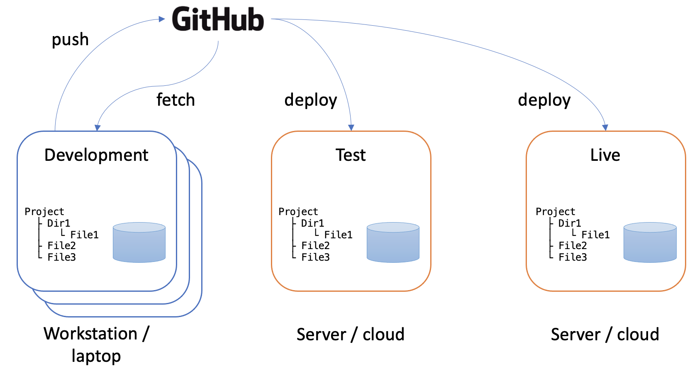
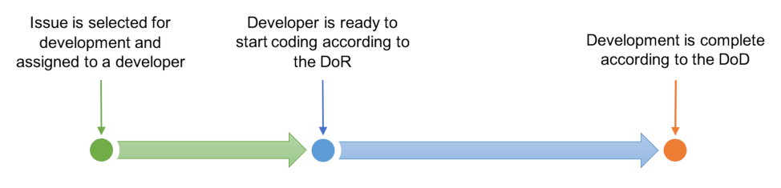

# Team workflows

###### Contents

*Under development*

While the basic function of GitHub is code version control, it has many other 
useful features that can be used to manage projects. In a team situation, 
the risks and problems quickly balloon compared to working on an individual project,
and it is a good investment of time to establish robust working routines. Using GitHub 
is not the only way to do this - there are other tools and platforms such as 
[Jira](https://www.atlassian.com/software/jira). However, as one of the most popular 
services, GitHub has reliability and recognition value in its favour.

## Environments

An *environment* is the working context of a software system. The term is widely used and it
is important to understand its full implications. The major distinction is between the *live*
environment (also referred to as the *production* environment) where a system is in actual use, 
and the *development* environment where software developers are making changes. As the software 
system evolves over time, code changes will be introduced into the live environment, but this has 
to be done very carefully to avoid any disruption to the users. The development environment 
replicates the live environment including code and supporting infrastructure such as databases. 
Because each member of the development team will be working on different changes to the codebase, 
each one will have their own development environment. This is an important detail: the development 
environment is not shared - each member of the team has their own copy which includes the last known 
good configuration of the codebase, plus the changes they are currently working on.

*Fig 1: System environments*

Code repositories such as GitHub are excellent tools for managing the synchronisation of the
various environments in use. Once developers have completed the changes they are working on, 
they *push* the code to the repository. Once any quality assurance procedures have been 
completed, the code can then be *deployed* to the live environment. Fig. 1 illustrates this
and also includes a test environment where integrated code can be tested before deployment.
Like the live environment, the test environment is a shared instance of the code that is
hosted on a server or on the cloud. Development environments, in contrast, are located on 
the workstation belonging to the individual developer. In order for their personal development
environment to be kept up to date, developers need to *fetch* changes from the repository on
a regular basis. Typically, this is done just before starting a new development task. During
work on a task, it is important that developer's working environment remains stable. Changes
from other developers are only introduced between one task and the next.

[Stephens, 2022, Ch. 14](https://learning.oreilly.com/library/view/beginning-software-engineering/9781119901709/c14.xhtml)

## Workflow

When you are working on a string of similar tasks using the same tools it can get a
bit boring. A natural tendency is to internalise short and reliable patterns for 
getting the work done. Perhaps it involves remembering to save your work at a 
particular point before going on to the next step, or creating stub tests as you go 
along so that you don't have to think too hard later on. As time goes on, you can 
reach the point where you just do these things on autopilot. What you are doing is
creating and maintaining a *workflow*. Just as with design patterns and many other 
aspects of software development, the way you organise your work is up to you. If you 
are working alone, creating your own workflows is convenient, but in a team situation 
it becomes vital going far beyond simply alleviating the boredom of repetition. 

One of the issues that needs to be addressed in a team context is that different
people prefer to do things in different ways. That is OK up to the point that it starts 
to reduce the overall efficiency of the team effort. That can occur for example if one 
person on a team fails to take into account someone else's needs. In that case, 
something does not get done at the most efficient moment, and time is lost later. 
Another case is where a developer finishes the task they are on but fails to update the 
documentation or let the rest of the team know that the task is complete. The solution 
to these and many other types of communication and coordination issues is to establish 
team workflows and to make sure that the whole team sticks to them.

GitHub defines several standard workflows that teams can follow when making changes
to code. They mainly revolve around the concept of *branching*. This only takes care
of problems that are directly related to development work however. If a team is also
using GitHub's issue tracking features, workflows are also needed to make sure that 
get done right first time. These notes will define particular workflows to deal with
several aspects of team code development. They are not necessarily optimal in all 
situations, and they are far from being the only way of doing things. They do, however,
define some reliable routines for small teams.

## Definition of Done

In Scrum, the *Definition of Done* (DoD) is a checklist of things that need to ticked off
before a task is considered finished. An example of a simple DoD might be:

* All acceptance criteria are met
* Unit test coverage > 80%
* Functional tests passed
* No known defects
* Peer code review is complete
* Documentation is updated

The DoD is a key part of a Scrum workflow because it requires a developer to take certain
actions at the point that a development task is finished. When working with platforms
like GitHub, we can also add administrative items to the checklist such as:

* Pull request created
* Issue status set to *Complete*

Certain items in the DoD assume that other actions have been taken earlier. For example,
acceptance criteria must have been defined, and a development branch must have been
created. The full definition of the workflow includes all the steps in the process 
and arranges them in the most efficient way.

## Definition of Ready

Another key point in the development process is when the developer starts making 
code changes. We can either assume that they are ready to do this, or we can create
a *Definition of Ready* (DoR) to be sure. The DoR might include items such as:

* Requirements are clear
* Requirements are testable
* Requirements are feasible
* Acceptance criteria defined
* Dependencies identified
* Developer is identified

As with the DoD, administrative items can be added such as those shown below which 
close the loop on some of the DoD items:

* Assign GitHub issue to the developer
* Create a development branch
* Synchronise development environment

In addition, there might be planning or documentary items on the list that are related
to understanding the requirement:

* Original issue has been elaborated
* Use cases have been defined
* Database changes have been identified and documented

## General overview

In light of the previous sections, two main phases of activity can be identified around
any piece of development work. The time required for each stage depends on the 
complexity of the original issue. 

## Further reading

[ GitHub flow](https://docs.github.com/en/get-started/quickstart/github-flow)

[ 5 Git workflows](https://zepel.io/blog/5-git-workflows-to-improve-development/)

[ Definition of Done](https://www.scrum.org/resources/blog/done-understanding-definition-done)

[ Definition of Ready](https://www.linkedin.com/pulse/definition-ready-dor-vs-done-dod-brian-will/)

